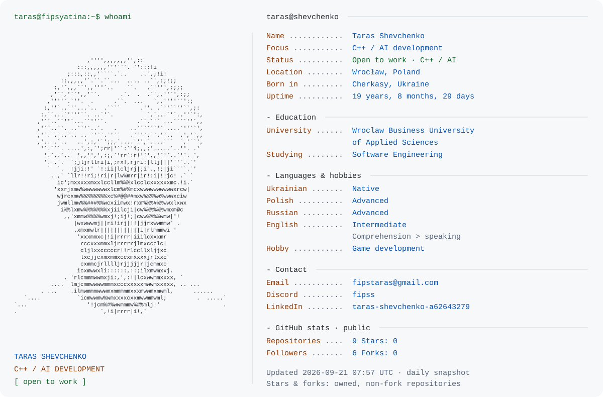

<picture>
  <source media="(prefers-color-scheme: dark)" srcset="./dark_mode.svg">
  
</picture>

  <a href="mailto:fipstaras@gmail.com">Email</a> ·
  Discord: <code>fipss</code> ·
  <a href="https://www.linkedin.com/in/taras-shevchenko-a62643279/">LinkedIn</a> ·
  <a href="https://github.com/fipsyatina">GitHub</a>

About me · text version

I'm **Taras Shevchenko**, a Software Engineering student at **Wroclaw Business University of Applied Sciences**, based in **Wrocław, Poland**. My focus is **C++ and AI development**, and I'm looking for work in this field. My hobby is **game development**.

I speak **Ukrainian** natively, **Polish** and **Russian** at an advanced level, and **English** at an intermediate level. My English comprehension is stronger than my speaking.

I was born in **Cherkasy, Ukraine**, on **23 December 2006 at 04:36**. Uptime is calculated from that moment using the `Europe/Kyiv` time zone and displayed as elapsed days, hours and minutes.

Public GitHub statistics and uptime refresh daily; the card shows its snapshot time. Inspired by <a href="https://github.com/Andrew6rant/Andrew6rant">Andrew6rant's terminal-style profile</a>. <a href="./MAINTENANCE.md">How this profile works</a>.
